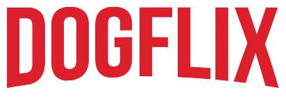

<h1 align='center'>DogFlix - #ImersaoReact</h1>

<h3>🔖 Descrição</h3>

Criação do DogFlix, app web utilizando React na semana da #ImersãoReact da Alura.

<h3>🚀 Tecnologias</h3>
<ul>
    <li><a href="https://reactjs.org/" target="_blank">React</a></li>
    <li><a href="https://reactrouter.com/" target="_blank">React Route</a></li>
    <li><a href="https://react-slick.neostack.com/" target="_blank">React Slick</a></li>
    <li><a href="https://github.com/typicode/json-server" target="_blank">JSON Server</a></li>
</ul>

<h3>ℹ️ Como usar</h3>

    # Clone esse repositório
    $ git clone https://github.com/Diegooliveyra/dogflix-Imersao-Alura.git
    
    # Instalar dependências
    $ npm install
    
    # Executar
    $ npm start

<h3>🖼 Layout</h3>

<h3>📝 Licença</h3>

O projeto se encontra sob licença MIT. Para mais detalhes, acesse <a href='LICENSE'>license<a>.

Criado com 💙 por <a href='https://github.com/Diegooliveyra/' target='blank'>Diego Oliveira</a>

